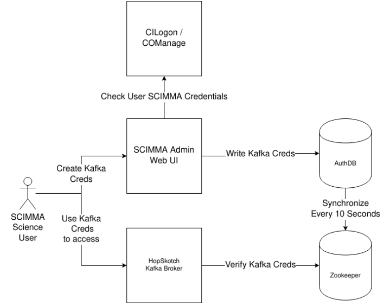

# scimma-admin

This is a web tool for managing access to SCIMMA's Hopskotch system. The main
deployment of it is at
[https://admin.dev.hop.scimma.org/hopauth/](https://admin.dev.hop.scimma.org/hopauth/).
At that URL, you can create, list, and revoke credentials which are used to
access Hopskotch's Kafka system. For more information on usage, see [the
guide](./doc/hopauth_guide.md).

## Design

The original design document is [on Google
Docs](https://docs.google.com/document/d/108v71YY9JJmfnY74IKPgHV5LXB6cxlKsTMdBq6zAJSs/edit).

At a high level: users authenticate against [the SCIMMA COManage
Registry](https://registry.scimma.org/registry/co_dashboards/dashboard/co:2) to
prove their identity. They can then generate credentials, which are held only in
memory; a hash of the credentials is stored in a Postgres database.
Asynchronously, these hashes are loaded into Kafka's backend so they can be used
by clients. Here's a diagram:

]

### Design: Authentication

scimma-admin authenticates users through an [OIDC](https://openid.net/connect/)
flow. The details of this are mostly handled by the third-party
[mozilla-django-oidc](https://mozilla-django-oidc.readthedocs.io/en/stable/)
plugin. However, a few details get custom behavior, which is implemented in a
[HopskotchOIDCAuthenticationBackend
class](./scimma_admin/hopskotch_auth/auth.py):
  - Users must be connected to LDAP (if this is not the case, it's probably a
    bug in COManage)
  - Users must be in the `SCiMMA Institute Active Members` COManage group
  - Users must be in the `kafkaUsers` COManage group

User uniqueness is maintained by using their `vo_person_id` value from COManage.

### Design: Credential Generation

Once a user has authenticated, they get access to the [credential management
tools](./scimma_admin/hopskotch_auth/views.py). The most important of these is
credential generation. This is implemented in the `new_credentials` method in
[`hopskotch_auth/models.py`](./scimma_admin/hopskotch_auth/models.py).

Usernames and passwords are generated automatically, with no user input. We do
this because:
 1. This way, all usernames are guaranteed to be unique.
 2. Nobody can impersonate other people with usernames - you can't create an
    account named 'swnelson' and do something nefarious.
 3. People can't use weak passwords which are crackable.
 4. People can't reuse passwords they use everywhere else, so we don't need to
    worry about password leaks on other sites.

Usernames are derived from a user's email address with a random suffix. Email
addresses might be a little nonunique, but they're more human-readable than
truly unique options like the `vo_person_id` field. The password is 32 random
characters.

Once a password is generated, it is only held in memory. Instead of storing the
password, we store a derived bundle of hashes, following [RFC 5802: Salted
Challenge Response Authentication Mechanism
(SCRAM)](https://tools.ietf.org/html/rfc5802) with the SHA-512 algorithm and
4096 hash iterations. This credential bundle is stored in a SQL database which
is managed with Django's ORM.

### Design: Infrastructure

scimma-admin is deployed on SCIMMA's Kubernetes cluster on AWS. Its
infrastructure is managed with Terraform through the
[aws-dev](https://github.com/scimma/aws-dev/blob/master/tf/eksDeployments/scimma-admin.tf)
repository. It relies on the presence of a Postgres database for storing
credentials.

Most of the machinery for the Kubernetes deployment is handled with the
[terraform-kubernetes-service](https://github.com/scimma/terraform-kubernetes-httpservice/)
module. This module uses HTTP health checks, so the root URL returns a plain
"OK" message too indicate it's healthy.

All credentials used in production are managed with AWS Secrets Manager. They're
loaded directly in [the Django `settings.py`
file](./scimma_admin/scimma_admin/settings.py).


## Developer Guide

### Local Development: prerequisites

You'll need AWS credentials. Install
[`scimma-aws`](https://github.com/scimma/scimma-aws-utils) first.

If you will develop on Windows OS, you will have issues with uWSGI package in requirements.txt. You can remove it and download uwsgi.exe. For running makefiles on Windows, you will need to download MinGW (the easy way) or Cygwin.

## Local Development: first-time setup

Run `make localdev-setup`. This will download a few secrets from AWS, which will
let you communicate with CILogon, even locally.

Start up the service by using `docker-compose`:
```
docker-compose up
```

Once it's up and running, run a database migration to prep the DB. You only need
to do this on first-time setup, and then whenever the DB schema is changed.

```
docker-compose exec django python manage.py migrate
```

You can then go to `http://127.0.0.1/hopauth/` to open the website locally.

## Local Development: running tests

With your service up and running in a terminal (with `docker-compose up`), open
a new terminal. Run this:

```
docker-compose exec django python manage.py test
```

### Deploying a new version

This project is deployed on SCIMMA's Kubernetes cluster through
https://github.com/scimma/aws-dev. To deploy a new version, you have to build
the docker container, push it to our container registry, and then update the
Kubernetes cluster. You can do this all in one pass by running [`./scripts/deploy/do_deploy.sh`](./scripts/deploy/do_deploy.sh).

Check the logs of your deployment with this:
```
kubectl logs -f -l appName=hopdevel-scimma-admin
```
