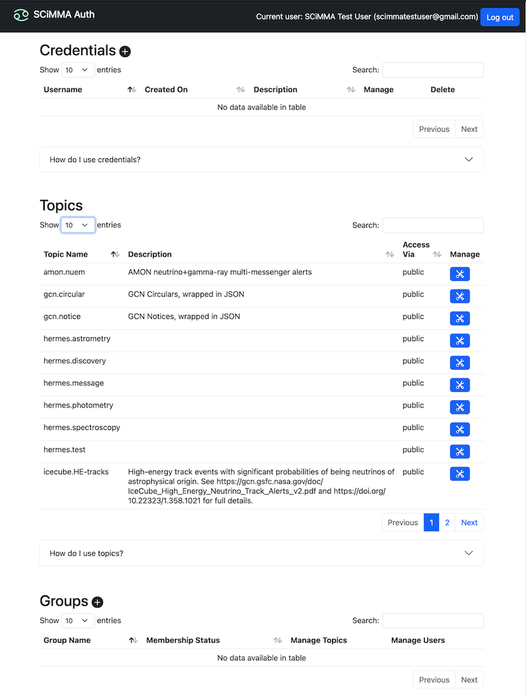
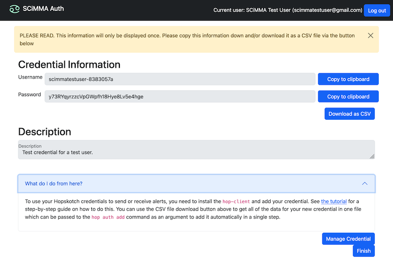
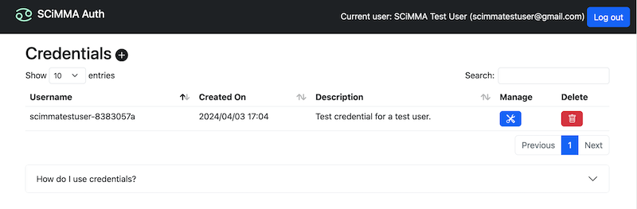
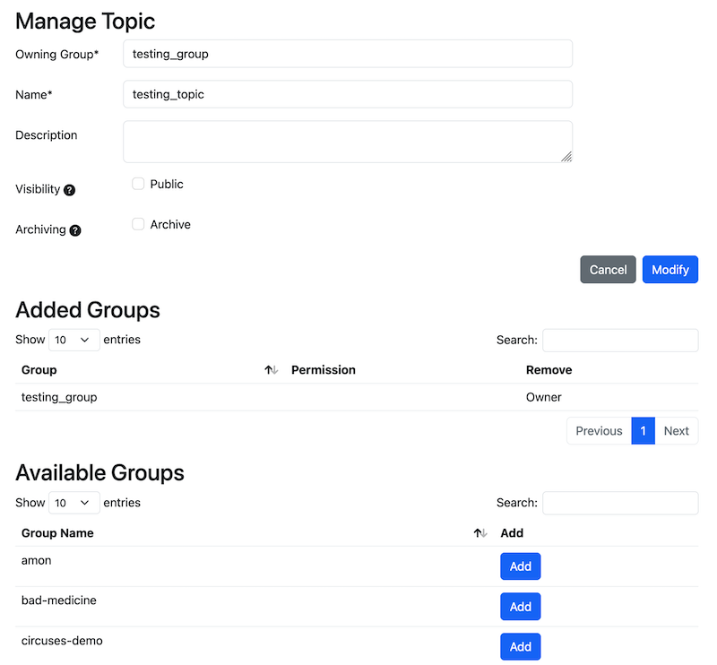
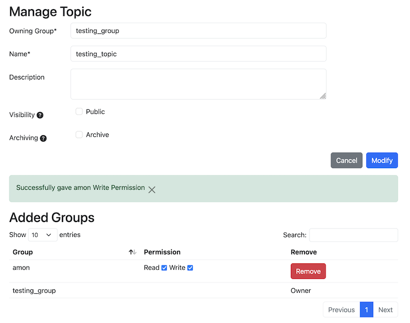
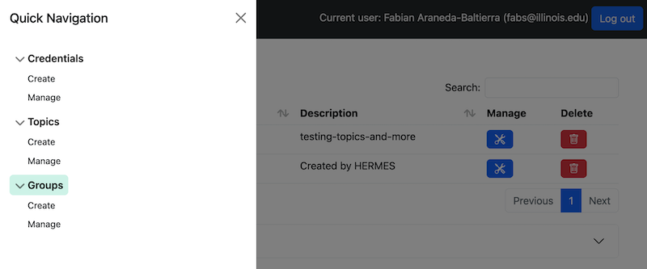

# The SCiMMA Hopskotch Authenticator

To make an account, go to [https://my.hop.scimma.org](https://my.hop.scimma.org). Click though the "scimma auth" screen access the CIlogon screen. At the CIlogon screen stop, and make an important decision before choosing an identity provider. The identity provider you select may furnish scimma with an email address.  That email address will automatically be your username within SCiMMA systems.

There are several considerations for a choice of identity provider:
1) Consider using the Google, ORCID, or experiment-specific identity provider rather than your institutional provider if you expect to change institutions.
2) If using Google, consider if your email address  will clearly convey who you are to anyone trying to admit you to a private group.  Recall that our Acceptable Use Policy prohibits  using an email address that seems to spoof another's identity.
3) Consider if any experiments or organizations will constrain your choice of email address as a condition for gaining access to a private channel.

You can use several identities/identity providers to make multiple distinct accounts, but keep in mind the potential confusion this might cause. If you make multiple accounts, it is a good practice to ensure that the accounts have separate purposes.

After you make your choice. Choose an identity provider. Make a note of your choice and consider selecting the comanage option to remember the provider.

Read the acceptable use policy and accept it if you agree. After acceptance, your account is created, and you will enter the SCiMMA authenticator application.

Hopskotch itself is intended to be accessed programmatically, so it uses additional credentials with fine-grained permissions which are issued and managed via the Hopskotch Authenticator ('Hopauth').

## Table of Contents
1. [Hopskotch Concepts](#hopskotch-concepts)
   1. [Administrator](#administrator)
   2. [Credential](#credential)
   3. [Group](#group)
   4. [Group Owner](#group-owner)
   5. [Topic](#topic)
2. [Hopauth for Users](#hopauth-for-users)
   1. [Logging In](#logging-in)
   2. [The Main Page](#the-main-page)
   3. [Creating a Credential](#creating-a-credential)
   4. [Adding Capabilities to a Credential](#adding-capabilities-to-a-credential)
   5. [Managing Group Members](#managing-group-members)
   6. [Creating Topics](#creating-topics)
   7. [Granting Other Groups Access to Topics](#granting-other-groups-access-to-topics)
3. [Hopauth for Administrators](#hopauth-for-ddministrators)
   1. [Creating Groups](#creating-groups)
   2. [Viewing Topics](#viewing-topics)
   3. [Viewing and Suspending Credentials](#viewing-and-suspending-credentials)

## Hopskotch Concepts

### Administrator

A member of the team which operates Hopskotch who has access to manage all users, groups, and credentials.

### Credential

A credential is a token issued by Hopauth and understood by Hopskotch/Kafka. Credentials have permissions attached to them which control which Kafka topics they are allowed to operate on, and in what ways. Every credential is owned by one user, but a user many own many credentials.

### Group

Hopauth organizes users into groups to make sharing ownership of and access to topics easy. Users may belong to many groups, and within each group a user may be either a regular member, or a group owner. Only administrators can create or delete groups.

### Group Owner

A user who is a member of a group and has authority to manage the group, including adding and removing users, creating and deleting topics, and sharing access to topics with other groups.

### Topic

A topic is the organizational unit of data storage in Apache Kafka. See the [Kafka documentation](https://kafka.apache.org/documentation/) for more details. In Hopskotch, each topic is owned by a group, who have full access to it by default, and may grant any chosen level of access to other groups.

## Hopauth for Users

### Logging In

The initial view of the Hopauth application when not logged in contains just the login link:

Logging in goes through the CILogon service and your institutional single sign on system, just as for logging in to COmanage:

After selecting your institution and authenticating normally, when logging in for the first time, you will be directed to the "Acceptable UsePolicy" page, where you can read an accept the policy.

If it's not your first time, after selecting you institution and authenticating, you should be directed back to the Hopauth main page.

### The Main Page

The main page shows all credentials you currently have, the option to create new credentials, and all groups to which you belong. When you first log in you will have no credentials issued, and probably belong to no groups (although a list of public topics is shown on the main page).

To access Hopskotch, you must create at least one credential.

### Creating a Credential

To create a credential, simple click the 'Create new credentials' button on the main page (the icon with the plus sign, next to "Credentials").

After that you will be required to add a description for your new credential.

Besides a description, no other input is required since credentials are randomly generated. The resulting page will show your new credential.

The plain-text password is **only** displayed **once** on this page, so be certain to record it. The 'Download as CSV' button on the page will download the whole credential as a file in a form that the `hop` client can accept. This is normally the easiest way to obtain and store your credentials.

After you return to the main page, your newly created credential will be listed there:

### Adding Capabilities to a Credential

By default, a new credential will allow you to authenticate with Hopskotch/Kafka, but will only allow reading data which has been designated as public. To read other topics, or to write data to topics, you must explicitly delegate those capabilities to the credential.

To add permissions to a credential, locate it in the table on the main page and click the corresponding 'Manage' button. This will take you to the management page for that credential. If you would like to delete a credential instead, click the corresponding 'Delete' button.

The management page shows all the available permissions that can be added to a credential, as well as all the permissions currently assigned to that credential, any of which can be removed.

The reason for configuring permissions per-credential, rather than just having one credential per user which has the same permissions as the user is to make it easy to create compartmentalized credentials for specific purposes. For example, you might create one credential with write permission to a single, critical alert topic which can be placed in an automated data processing pipeline, and then create a separate credential with read access to many topics which you keep on your laptop for doing interactive analysis work.

The permissions available to associate with your credentials are shown in the 'Available Permissions' section. These will include all of the permissions available to you because of your group memberships. To add one, simply select it from the list and press the 'Add' button. It should then appear in the table above. The listing will show the topics to which the permission applies, along with that topic's description, the group through which that permission is conferred, and whether the permission allows reading, writing, or both.

## Manage Groups and Topics

If you are an owner of a group, you have the authority to manage the membership of that group. All groups to which you belong are listed on the main page, and for each group in which you are an owner, there will be a button to 'Manage Users' and another to 'Manange Topics'. After clicking, each button will take you to the proper management page.

### Managing Group Members

The management page for a group shows all current members and their level of membership, gives the option to add new group members or remove the existing ones.

To add a member, simply click the 'Add' button for any user in the list at the 'Available Users' section. After adding to your group, you can select whether that person should be a regular member or also be an owner from the drop-down menu under 'Permission'. Users are listed with both their internal SCiMMA identifier and their email address, which is easier to recognize.

In the 'Current Members' section of the page any member of the group can be removed or have their membership status switched between regular membership and ownership of the group.

### Managing Topics

If you are the owner of a group you can create topics owned by your group where you and other members of your group can write (and read) data in Hopskotch. To do so, enter the desired topic name into the field in the 'Create Topic' section of the group topic's management page, and click the 'Create' button. Topic names must be unique within the group, may be 1-249 characters long, and may only contain the characters `a-zA-Z0-9._-`.

A topic is always accessible to all members of the group which owns it, but by default it is not accessible to any other users.

### Granting Other Groups Access to Topics

Since, by default, Hopskotch users who are not members of a group cannot access that group's topics, it may be desirable to grant such access in order to share data.

To manage access to a topic, locate the topic in the 'Manage Group Topics' page, and click the 'Edit' button. This will open the topic's management page. In the 'Manage Group Topics' page you can also delete the topic entirely.

The 'Manage Topic' page shows all currently granted permissions (read/write) for the topic (at the group level), and gives the option to modify those permissions. The owning group will have 'All' permission for the topic; this permission cannot be changed or removed as long as the topic exists. In this page you can also modify the topic's description, define its visibility and set the archiving option.

One option to grant specific levels of access to specific groups is granting a group access to a topic. This can be done by clicking the 'Add' button next to a group's name in the 'Available Groups' section, then you will have to set the read/write permissions, once the group appears in the 'Added Groups' section. One this is done, members of the chosen group will have the option to add this permission to their credentials. :

Access granted to other groups can be revoked at any time, if necessary. To do so, press the 'Revoke' button corresponding to the permission where it is listed in the 'Active Group Permissions' section.

The second option is to mark the entire topic as having public read access. This will allow any authenticated Hopskotch user to read it, regardless of group membership. However, this mechanism cannot grant any other type of access (e.g. there is no option for public write access). To enable this option, check the 'Public' checkbox next to 'Visibility'. Uncheck to revoke public access.

## Hopauth for Administrators

In addition to all of the capabilities granted to normal users, administrators have a few additional capabilities in Hopauth. These are used both for normal operations and for responding to any security incidents which occur. Administrative management is accessed via the top-left menu button on the main page, which leads to the administrators' menu:

### Creating Groups

Administrators are responsible for creating all groups. Additionally, they can manage the membership of any group.

Group creation is accessed by the menu following `Quick Navigation > Groups > Manage`. The group creation form requires only the name and the description for the new group to be created. Group names must be unique and are limited to 256 characters.

Administrative group management is accessed via the top-left menu button on the main page (`Quick Navigation > Groups > Manage`), which leads to the group's management page. From this page it is possible to see a complete list of all groups which currently exist, and to edit or delete each.

After creating a new group, you will be automatically sent to the group's management page, which is the same as for other users. Administrators, however, automatically have the same capabilities to manage within a group as owners of the group. Since a newly created group has no owners, it is advisable that the admin who creates it should add at least one user to it as an owner, who will then be able to add other owners and regular members as needed. Otherwise, all members and topics for the group will have to be added by administrators.

### Viewing Topics

Administrators can manage any topic via the owning group's management page. However, this is not convenient when the owning group is not known ahead of time. For this purpose, the administrator topic management page is provided, which simply contains a listing of all topics and the groups which own them, with buttons to access each topic's management page, or delete the topic. This page is reached from the top-left menu button on the main page (`Quick Navigation > Topics > Manage`)main page. 

### Viewing and Suspending Credentials

Administrators can also view and edit the permissions of all users' credentials. Administrative credential management is accessed via the top-left menu button on the main page (`Quick Navigation > Credentials > Manage`), which leads to the administrators' credential management page. In the credential listing each credential's name is followed by the username associated to it, the creation date, the description and three buttons the allows to 'Manage', 'Suspend, and 'Delete' the credential.

By clicking on the credential's 'Manage' button an administrator has access to the same page as the credential's owner, and has all of the same capabilities to edit the credential's permissions.

A suspended credential is preserved in the system with all of its permissions, but will not be accepted by Hopskotch/Kafka until the suspension is removed. The intended purpose of this feature is for containment in case of security incidents. If a credential is suspected to have been compromised, it can be suspended to remove access without losing information about the credential and its capabilities. It should be noted that if a credential is suspected to be compromised because the owning user's account may have been compromised, hen in addition to suspending all of the user's credentials, the user's account should be suspended as well, as otherwise the account could simply be used to issue additional, equivalent credentials.