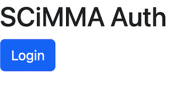
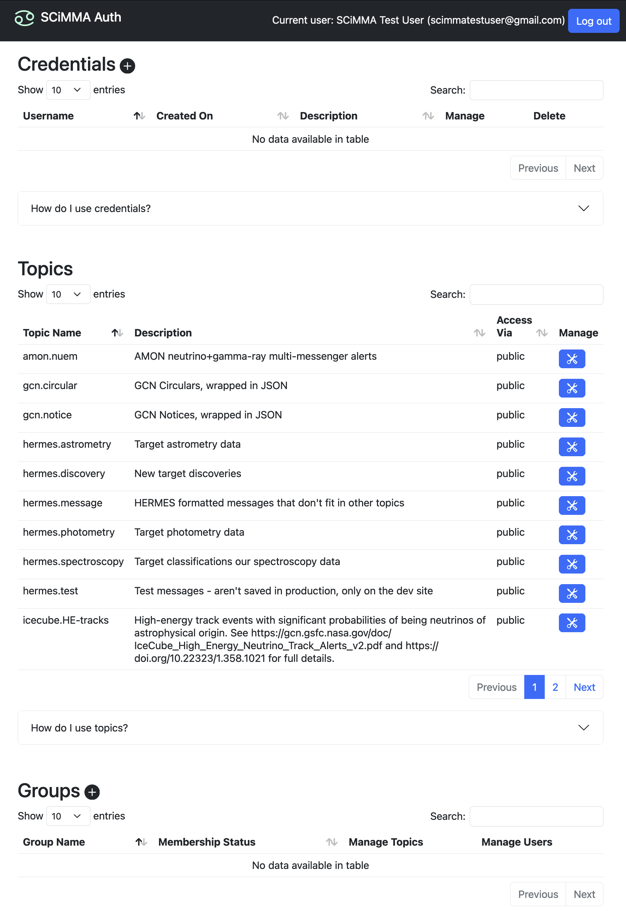
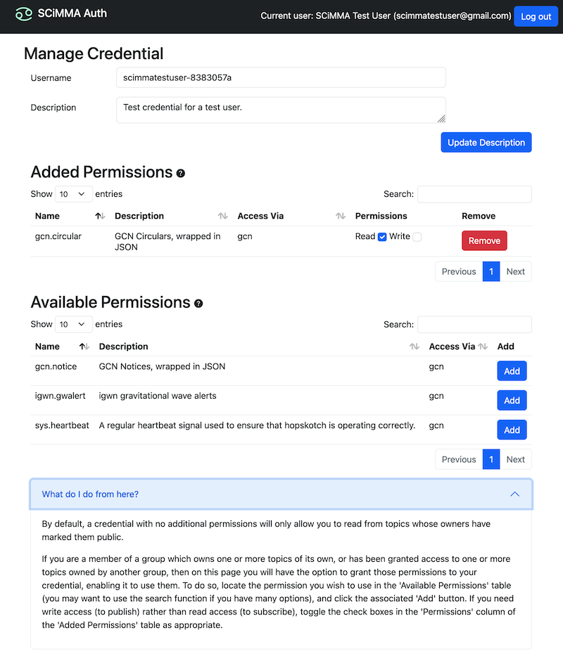
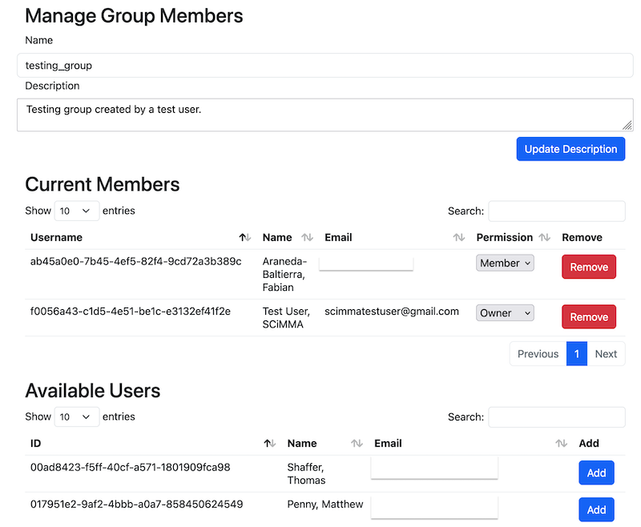
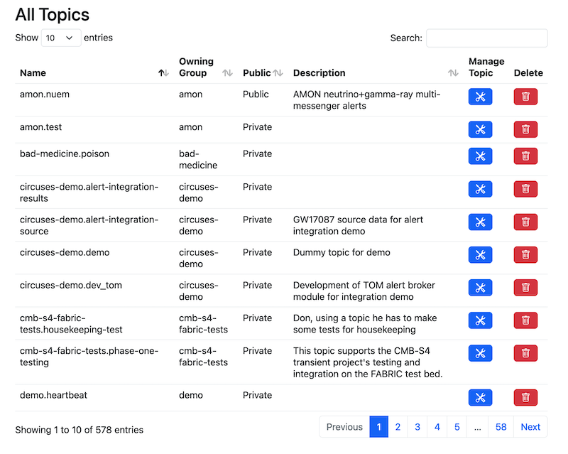

# The SCiMMA Hopskotch Authenticator

User accounts for Hopskotch are initially created through COmanage. To join, go to [https://scimma.github.io/IAM/Instructions/JoinInstitute](https://scimma.github.io/IAM/Instructions/JoinInstitute) and follow the instructions to create an account using your institutional identity. The final step of the process, approval of your account, may take around a day to be processed.

Once your account is approved go to the registry page, and click on your name where it is displayed near the upper right to open the associated menu, and click on the 'My Groups' button to manage your group memberships. Locate the 'kafkaUsers' group (which may not appear on the first page of the listing; entering it into the name field of the 'Filter' tool at the top of the table can help). The group should be 'Open', allowing you to join it; to do so check the 'Member' box in the 'Actions' column at the right of the table, then click 'Save'. This change should propagate in only a few minutes.

Hopskotch itself is intended to be accessed programmatically, so it uses additional credentials with fine-grained permissions which are issued and managed via the Hopskotch Authenticator ('Hopauth'). 

## Table of Contents
1. [Hopskotch Concepts](#hopskotch-concepts)
   1. [Administrator](#administrator)
   2. [Credential](#credential)
   3. [Group](#group)
   4. [Group Owner](#group-owner)
   5. [Topic](#topic)
2. [Hopauth for Users](#hopauth-for-users)
   1. [Logging In](#logging-in)
   2. [The Main Page](#the-main-page)
   3. [Creating a Credential](#creating-a-credential)
   4. [Adding Capabilities to a Credential](#adding-capabilities-to-a-credential)
   5. [Managing Group Members](#managing-group-members)
   6. [Creating Topics](#creating-topics)
   7. [Granting Other Groups Access to Topics](#granting-other-groups-access-to-topics)
3. [Hopauth for Administrators](#hopauth-for-ddministrators)
   1. [Creating Groups](#creating-groups)
   2. [Viewing Topics](#viewing-topics)
   3. [Viewing and Suspending Credentials](#viewing-and-suspending-credentials)

## Hopskotch Concepts

### Administrator

A member of the team which operates Hopskotch who has access to manage all users, groups, and credentials. 

### Credential

A credential is a token issued by Hopauth and understood by Hopskotch/Kafka. Credentials have permissions attached to them which control which Kafka topics they are allowed to operate on, and in what ways. Every credential is owned by one user, but a user many own many credentials. 

### Group

Hopauth organizes users into groups to make sharing ownership of and access to topics easy. Users may belong to many groups, and within each group a user belongs to the user may be either a regular member, or a group owner. Only administrators can create or delete groups. 

### Group Owner

A user who is a member of a group and has authority to manage the group, including adding and removing users, creating and deleting topics, and sharing access to topics with other groups. 

### Topic

A topic is the organizational unit of data storage in Apache Kafka. See the [Kafka documentation](https://kafka.apache.org/documentation/) for more details. In Hopskotch, each topic is owned by a group, who have full access to it by default, and may grant any chosen level of access to other groups. 

## Hopauth for Users

### Logging In

The initial view of the Hopauth application when not logged in contains just the login link:

Logging in goes through the CILogon service and your institutional single sign on system, just as for logging in to COmanage:

After selecting you institution and authenticating normally, you should be directed back to the Hopauth main page. 

### The Main Page

The main page shows all credentials you currently have, the option to create new credentials, and all groups to which you belong. When you first log in you will have no credentials issued, and probably belong to no groups. 

To access Hopskotch, you must create at least one credential. 

### Creating a Credential

To create a credential, simple click the 'Create new credentials' button on the main page. No other input is required, as credentials are randomly generated. The resulting page will show your new credential. 

The plain-text password is **only** displayed **once** on this page, so be certain to record it. The 'Download' button on the page will download the whole credential as a file in a form that the `hop` client can accept. This is normally the easiest way to obtain and store your credentials. 

After you return to the main page, your newly created credential will be listed there: 

### Adding Capabilities to a Credential

By default, a new credential will allow you to authenticate with Hopskotch/Kafka, but will only allow reading data which has been designated as public. To read other topics, or to write data to topics, you must explicitly delegate those capabilities to the credential. 

To add permissions to a credential, locate it in the table on the main page and click the corresponding 'Edit' button. This will take you to the management page for that credential. 

This page shows all permissions currently assigned to the credential, any of which can be removed, allows adding additional permissions, and allows the entire credential to be deleted. 

The reason for configuring permissions per-credential, rather than just having one credential per user which has the same permissions as the user is to make it easy to create compartmentalized credentials for specific purposes. For example, you might create one credential with write permission to a single, critical alert topic which can be placed in an automated data processing pipeline, and then create a separate credential with read access to many topics which you keep on your laptop for doing interactive analysis work. 

The permissions available to associate with your credentials are shown in the 'Add Permission' section. These will include all of the permissions available to you because of your group memberships. To add one, simply select it from the list and press the 'Add permission' button. It should then appear in the table above. As permission is named with the topic to which it applies and the type of access to be allowed, separated by a colon. 

### Managing Group Members

If you are an owner of a group, you have the authority to manage the membership of that group. All groups to which you belong are listed on the main page, and for each group in which you are an owner, there will be an 'Edit' button which will take you to the management page for that group. 

The management page for a group shows all current members and their level of membership, gives the option to add new group members, lists topics owned by the group, and gives the option to create new topics. 

To add a member, simply select the user from the drop-down list in the 'Add Member' section, select whether that person should be a regular member or also be and owner, and then click the 'Add user' button. Users are listed with both their internal SCiMMA identifier and their email address, which is easier to recognize. 

In the 'Current Members' section of the page any member of the group can be removed or have their membership status switched between regular membership and ownership of the group. 

### Creating Topics

If you are the owner of a group you can create topics owned by your group where you and other members of your group can write (and read) data in Hopskotch. To do so, enter the desired topic name into the field in the 'Add Topic' section of the group's management page, and click the 'Create' button. Topic names must be unique across the system, may be 1-249 characters long, and may only contain the characters `a-zA-Z0-9._-`. 

A topic is always accessible to all members of the group which owns it, but by default it is not accessible to any other users. 

### Granting Other Groups Access to Topics

Since, by default, Hopskotch user who are not members of a group cannot access that group's topics, it may be desirable to grant such access in order to share data. 

To manage access to a topic, locate the topic in the 'Topics' section of the group page, and click the 'Edit' button. This will open the topic's management page. 

This page shows all currently granted permissions (at the group level) for the topic, gives the option to add additional permissions, and to delete the topic entirely. The tale of permissions will always show the owning group having 'All' permission for the topic; this permission cannot be changed or removed as long as the topic exists. 

The first option is to grant specific levels of access to specific groups. This can be done by choosing the permission type and group to grant access from the lists in the 'Add Permission' section, and then pressing the 'Add permission' button. One this is done, members of the chosen group will have the option to add this permission to their credentials. The permission will also be listed in the 'Active Group Permissions' section of the topics management page:

Access granted to other groups can be revoked at any time, if necessary. To do so, press the 'Revoke' button corresponding to the permission where it is listed in the 'Active Group Permissions' section. 

The second option is to mark the entire topic as having public read access. This will allow any authenticated Hopskotch user to read it, regardless of group membership. However, this mechanism cannot grant any other type of access (e.g. there is no option for public write access). To enable this option, press the 'Add public access' button in the 'Public read-access' section. If a topic already has public read access, and you wish to remove it, the button in this section will be replaced with one for 'Remove public access' for this purpose. 

## Hopauth for Administrators

In addition to all of the capabilities granted to normal users, administrators have a few additional capabilities in Hopauth. These are used both for normal operations and for responding to any security incidents which occur. 

### Creating Groups

Administrators are responsible for creating all groups. Additionally, they can manage the membership of any group. 

Administrative group management is accessed via the 'Manage Groups' button on the main page, which leads to the administrators' group management page:

From this page it is possible to see a complete list of all groups which currently exist, and to edit or delete each. Finally, at the bottom of the page is the group creation form, which requires only the name of the new group to be created. Group names must be unique and are limited to 256 characters. 

After creating a new group, you will be automatically sent to the group's management page, which is the same as for other users. Administrators, however, automatically have the same capabilities to manage within a group as owners of the group. Since a newly created group has no owners, it is advisable that the admin who creates it should add at least one user to it as an owner, who will then be able to add other owners and regular members as needed. Otherwise, all members and topics for the group will have to be added by administrators. 

### Viewing Topics

Administrators can manage any topic via the owning group's management page. However, this is not convenient when the owning group is not known ahead of time. For this purpose, the administrator topic management page is provided, which simply contains a listing of all topics and the groups which own them, with links to manage either. This page is reached from the 'Manage Topics' button on the main page. 

### Viewing and Suspending Credentials

Administrators can also view and edit the permissions of all users' credentials. Administrative credential management is accessed via the 'Manage Credentials' button on the main page, which leads to the administrators' credential management page:

in the credential listing, each credential's name is a link to the permissions management page for that credential:

This is the same as the credential owner's view of this page, and has all of the same capabilities to edit the credential's permissions or delete it, and in addition gives the option to suspend the credential. 

A suspended credential is preserved in the system with all of its permissions, but will not be accepted by Hopskotch/Kafka until the suspension is removed. The intended purpose of this feature is for containment in case of security incidents. If a credential is suspected to have been compromised, it can be suspended to remove access without losing information about the credential and its capabilities. It should be noted that if a credential is suspected to be compromised because the owning user's account may have been compromised, hen in addition to suspending all of the user's credentials, the user's account should be suspended as well, as otherwise the account could simply be used to issue additional, equivalent credentials. Account suspension is handled in COmanage. 